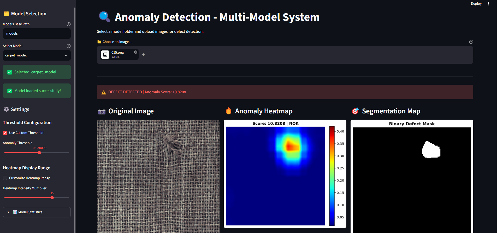

# Anomaly Detection

A Streamlit web app for visual defect detection, built on a frozen **ResNet50** feature extractor paired with a lightweight **convolutional autoencoder**. Upload an image and the app returns an anomaly score, a heatmap of where the defect is, and a binary segmentation mask.

## Screenshots

!

## How it works

The model never learns what a defect looks like — it only learns to reconstruct *normal* features. Anything it reconstructs badly is flagged as anomalous.

1. **Feature extraction** — A pretrained ResNet50 (frozen, `eval` mode) runs over the 224×224 input. Forward hooks tap the outputs of `layer2` and `layer3`; both maps are average-pooled, resized to a common resolution, and concatenated into a 1536-channel patch tensor.
2. **Reconstruction** — `FeatCAE`, a 1×1-convolutional autoencoder, compresses that tensor to a 100-dim latent space and reconstructs it. It is trained only on defect-free samples.
3. **Scoring** — Per-pixel squared reconstruction error forms the anomaly map. The image score is the mean of the **top 10** error values, so a small defect in an otherwise clean image still registers.
4. **Decision** — Score ≥ threshold → `DEFECT`. The threshold ships in `threshold_config.json`, derived from the training-set error distribution.

Because the ResNet50 backbone is frozen and pretrained, only the autoencoder needs training — a few hundred normal images is typically enough.

## Setup

Requires Python 3.10+.

```bash
git clone https://github.com/farhankhoso/anomaly_detection_model.git
cd anomaly_detection_model

python -m venv venv
venv\Scripts\activate        # Windows
# source venv/bin/activate   # macOS / Linux

pip install -r requirements.txt
```

The PyPI `torch` wheel is CPU-only. For GPU inference, install the CUDA build first, then the rest:

```bash
pip install torch==2.2.0 torchvision==0.17.0 --index-url https://download.pytorch.org/whl/cu121
pip install -r requirements.txt
```

ResNet50's ImageNet weights download automatically on first run (~100 MB), so the initial launch needs an internet connection.

## Usage

```bash
streamlit run main.py
```

Opens at `http://localhost:8501`. Pick a model in the sidebar, upload a PNG/JPG, and read the results.

Sample images are in `test_data/` if you just want to see it work.

## Models

Models are discovered by scanning the `models/` directory. A folder is recognised only if it contains **both** required files:

```
models/
└── carpet_model/
    ├── anomaly_model_complete.pth    # required — autoencoder weights + config
    ├── threshold_config.json         # required — decision threshold + error stats
    └── training_history.pth          # optional — loss curves
```

To add a model, drop a new folder in `models/` with those two files and refresh the page. It appears in the sidebar dropdown automatically — no code changes.

The backbone is *not* stored per-model; every model reuses the same pretrained ResNet50 fetched by torchvision.

### Included: `carpet_model`

Trained on the carpet category of the MVTec AD dataset.

| Statistic | Value |
|---|---|
| Threshold | 0.027676 |
| Mean error | 0.018870 |
| Std error | 0.002935 |
| 95th percentile | 0.024263 |
| 99th percentile | 0.027788 |

## Settings

Everything below is adjustable from the sidebar at runtime; none of it retrains the model.

| Control | Effect |
|---|---|
| **Models Base Path** | Where to scan for model folders. Default `models`. |
| **Custom Threshold** | Override the shipped threshold. Lower → more sensitive, more false positives. |
| **Heatmap Range** | Min/max values for the colour scale. Only affects display. |
| **Intensity Multiplier** | Scales the heatmap ceiling (1–20, default 10). Raise it if everything looks uniformly red. |
| **Heatmap Opacity** | Blend weight of the heatmap over the original in the overlay view. |

## Output

- **Status banner** — `PRODUCT OK` or `DEFECT DETECTED`
- **Heatmap** — jet-coloured reconstruction error; hot regions are anomalous
- **Segmentation mask** — binary map of pixels well above the error ceiling
- **Metrics** — raw score, active threshold, normalised score, classification
- **Overlay** — heatmap composited over the original at adjustable opacity

The **normalised score** is `score / threshold`, so 1.0 sits exactly at the decision boundary — 0.6 is comfortably clean, 1.8 is a confident defect. It is the most readable number of the four.

## Repository contents

| Path | Purpose |
|---|---|
| `main.py` | The application |
| `requirements.txt` | Python dependencies |
| `models/carpet_model/` | Trained carpet model |
| `test_data/` | Sample images |

Training datasets, virtual environments, and archives are excluded via `.gitignore`.

## Notes

- Runs on CPU. A GPU speeds up inference but is not required.
- Input is resized to 224×224; heatmaps are rendered at 128×128.
- The threshold is dataset-specific. A model trained on carpet will not transfer to another product — train a new one and add it as its own folder.
